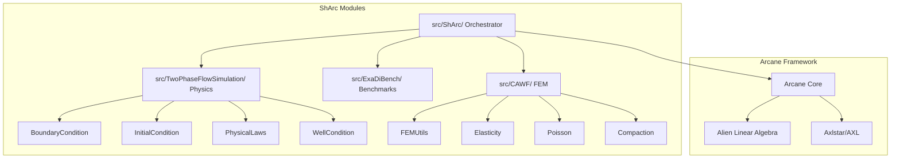

ShArc is organized as a set of modules orchestrated by the Arcane framework.

## Module Architecture

## Build system

ShArc uses a custom CMake build system with macros like `createLibrary`, `createExecutable`, `generateCMakeLists`, `linkLibraries`, `commit`, `loadMeta`, and `loadPackage`. Source file registration is handled via `config.xml` and `libraries.xml` in each module, plus `generateCMakeLists()` in CMake.

## Data models

Data models are defined via GUMP (`.gump`) files, e.g. `TwoPhaseFlowSimulation/DataModel/ArcRes.gump`, which generate C++ code for variable definitions and service interfaces.
