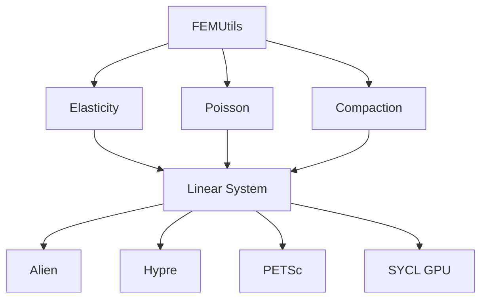

# CAWF — Compaction/Elasticity/FEM

CAWF is a finite element library for geomechanical simulation, defined in `src/CAWF/`.

## Components

| Sub-module | Description |
|------------|-------------|
| [FEMUtils]() | Core FEM library (DOF management, matrices, quadrature) |
| [Elasticity]() | Linear elasticity solver based on Navier's equation |
| [Poisson]() | Poisson equation FEM solver |
| [Compaction]() | Geomechanical compaction solver |
| [DynamicMeshMng]() | Dynamic mesh adaptation service |

## Backends

Linear solvers can use Alien (default), Hypre, PETSc, or SYCL GPU backends depending on configuration.
